# Algothon-Quant: Full-Stack Quantitative Trading Platform

A high-performance, polyglot platform for quantitative trading research, backtesting, and visualization. Built with Python, Rust, Julia, and a Next.js frontend, all containerized with Docker.

---

## 🚀 Architecture Overview

This project is a full-stack, end-to-end system for quantitative finance. It combines a powerful backend for strategy development with a modern web UI for interaction and visualization.

```mermaid
graph TD
    subgraph "User Interaction"
        A[Browser] -->|HTTP Request| B(Next.js Frontend);
    end

    subgraph "Frontend (Next.js)"
        B -->|API Call /api/backtest| C{API Route};
    end

    subgraph "Backend (Python)"
        C -->|Spawns Process| D[backend.cli_backtest];
        D --> E{Strategies};
        E --> F[Models: Momentum, MR, Ensemble];
        F --> G[Core Logic];
        G --> H[Data Loader];
        H --> I[prices.txt];
        D -->|Logs to| J(MLflow Tracking);
    end

    subgraph "High-Performance (Rust)"
        K[Rust: fastcalc] <-->|PyO3| G;
    end

    subgraph "Experiment Tracking"
        J -->|View in UI| L[MLflow UI];
    end

    subgraph "Containerization"
        M(Docker Compose) -->|Orchestrates| N((Container));
        N --> B;
        N --> D;
        N --> L;
    end

    subgraph "CI/CD"
        O(GitHub Push) --> P{GitHub Actions};
        P -->|Runs Tests| Q(Pytest);
        P -->|Runs Backtest| D;
    end

    style B fill:#000,stroke:#61DAFB,stroke-width:2px
    style J fill:#000,stroke:#2096F3,stroke-width:2px
    style K fill:#000,stroke:#DE6832,stroke-width:2px
    style M fill:#000,stroke:#2496ED,stroke-width:2px
    style P fill:#000,stroke:#2088FF,stroke-width:2px
```



---

## ✨ Key Features

-   **Polyglot Backend**: Python for core logic, Rust for high-speed calculations (`fastcalc`), and Julia hooks for advanced modeling.
-   **Multiple Strategies**: Includes Momentum, Mean Reversion, and a sophisticated Ensemble model (XGBoost, ARIMA, LSTM).
-   **Realistic Backtesting**: Simulates trading with a `$10k` position cap and `10 bps` commission.
-   **Experiment Tracking**: Integrated with **MLflow** to log parameters, metrics, and models for every run.
-   **Web UI**: A **Next.js** frontend with **TypeScript** and **Tailwind CSS** to run backtests and visualize P&L and drawdown charts.
-   **Containerized**: Fully containerized with **Docker** and **Docker Compose** for easy, one-command setup.
-   **Automated CI/CD**: A **GitHub Actions** workflow automatically tests, builds, and validates the system on every push.

---

## 🛠️ Tech Stack

-   **Backend**: Python 3.12, PyO3, PyJulia
-   **Frontend**: Next.js, React, TypeScript, Plotly.js, Tailwind CSS
-   **High-Performance**: Rust (stable)
-   **Data Science**: Pandas, NumPy, Scikit-learn, XGBoost, Statsmodels
-   **MLOps**: MLflow
-   **CI/CD**: GitHub Actions
-   **Containerization**: Docker, Docker Compose

---

## 🏁 Getting Started

### Prerequisites

-   Docker and Docker Compose

### One-Command Setup with Docker

This is the recommended way to run the entire application.

1.  **Clone the repository:**
    ```sh
    git clone https://github.com/Anjaniputra15/algothon-quant.git
    cd algothon-quant
    ```

2.  **Build and run with Docker Compose:**
    ```sh
    docker-compose up --build
    ```
    *(The first build will take some time. Subsequent builds are much faster.)*

3.  **Access the services:**
    -   **Frontend Application**: [http://localhost:3000](http://localhost:3000)
    -   **MLflow UI**: [http://localhost:5000](http://localhost:5000)

---

## 🔧 Local Development (Without Docker)

### 1. Backend Setup

```sh
# Install Python dependencies
pip install -e ".[dev,rust,julia]"

# Build Rust extensions
cd rust/fastcalc
maturin develop
cd ../..

# Setup Julia
julia --project=. -e 'using Pkg; Pkg.instantiate()'

# Run backend demos
python demo_backtester.py
```

### 2. Frontend Setup

```sh
# Navigate to the frontend directory
cd frontend/nextjs

# Install Node.js dependencies
npm install

# Run the frontend dev server
npm run dev
```
The frontend will be available at [http://localhost:3000](http://localhost:3000).

---

## ⚙️ Usage

### Frontend UI

1.  Open [http://localhost:3000](http://localhost:3000).
2.  Select a trading strategy from the dropdown menu.
3.  Click "Run Backtest" to trigger the backend API.
4.  View the cumulative P&L and drawdown charts.

### MLflow

1.  Open [http://localhost:5000](http://localhost:5000).
2.  View all experiment runs, compare parameters, and see model metrics.
3.  Promote the best models to "Production" using the `scripts/register_final.py` script.

---

## 📁 Project Structure

```
.
├── .github/workflows/ci.yml # CI/CD pipeline
├── backend/                 # Python backend (strategies, models, data)
├── frontend/nextjs/         # Next.js frontend application
├── rust/fastcalc/           # High-performance Rust crate
├── scripts/                 # Utility and deployment scripts
├── tests/                   # Python and Rust tests
├── Dockerfile               # Multi-stage Docker build
├── docker-compose.yml       # Docker service orchestration
└── README.md                # You are here
```

---

## 🤝 Contributing

Contributions are welcome! Please open an issue or submit a pull request for any improvements or new features.

1.  Fork the repository.
2.  Create a new feature branch (`git checkout -b feature/my-new-feature`).
3.  Commit your changes (`git commit -am 'Add some feature'`).
4.  Push to the branch (`git push origin feature/my-new-feature`).
5.  Create a new Pull Request.

---

## 📄 License

This project is open-source and available for educational and research purposes. Please see the `LICENSE` file for more details.
